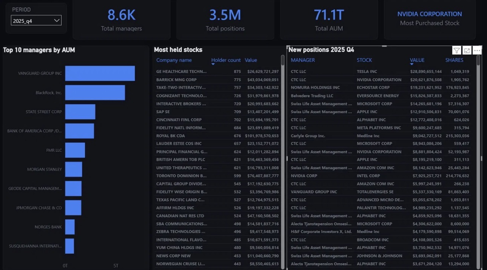
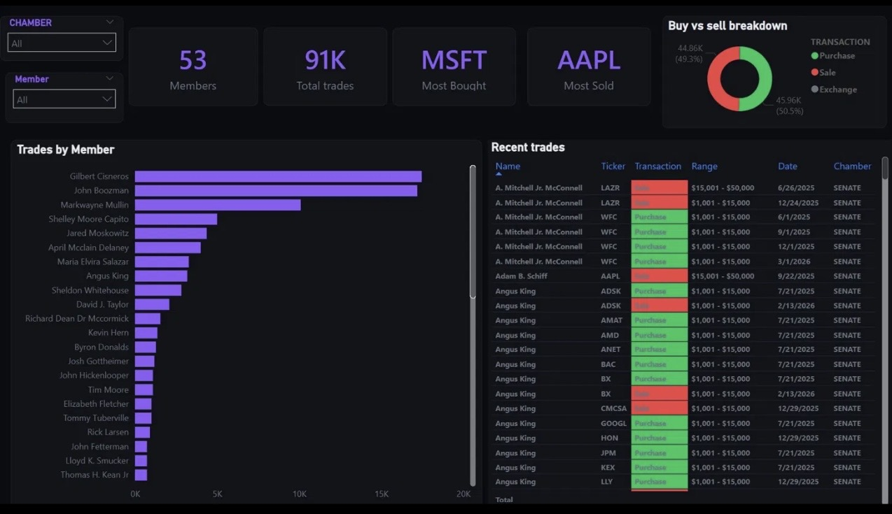
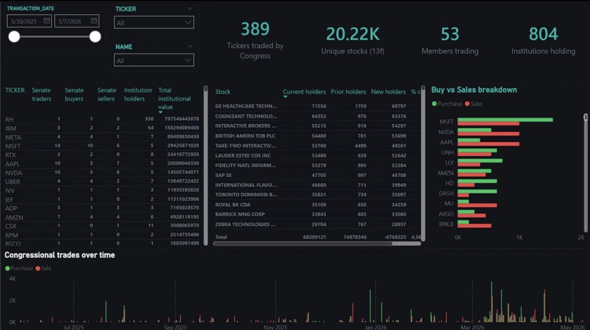

# 13F Institutional Holdings & Congressional Trades Dashboard

A data pipeline and Power BI dashboard tracking SEC 13F institutional holdings and congressional stock trades.

## Stack
- **Data ingestion:** Python, Google Cloud Run
- **Storage:** Google BigQuery
- **Scheduling:** Google Cloud Scheduler
- **Visualization:** Power BI (DirectQuery)
- **Data sources:** SEC EDGAR, Quiver Quantitative API

## Pipelines
- `sec_13f_pipeline/` — Downloads quarterly 13F filings from SEC EDGAR (~3.5M rows per quarter)
- `politician_trades_pipeline/` — Pulls House & Senate congressional trades from Quiver API

## Dashboard
- **Page 1:** Institutional holdings — AUM, top managers, most held stocks, new positions by quarter
- **Page 2:** Congressional trades — House & Senate activity, buy/sell breakdown, most traded stocks
- **Page 3:** Cross-analysis — Congressional trades vs institutional holdings overlap, institutional momentum

## Dashboard Preview

### Page 1 — Institutional Holdings

### Page 2 — Congressional Trades

### Page 3 — Cross Analysis

## Architecture

SEC EDGAR / Quiver API → Cloud Run (Python) → BigQuery → Power BI
                                ↑
                        Cloud Scheduler
                      (quarterly + weekly)

